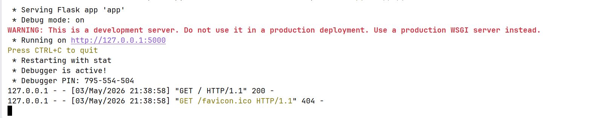

1. Create Virtual Environment

    ```bash
    python -m venv venv
    ```
2. Activate

    ```bash
     .\venv\Scripts\activate
    ```
   Create လုပ်ထားတဲ့ venv ထဲက script ထဲက activate ကို run ပြီး activate လုပ်ရတယ်။

   `(venv) PS C:\Users\oakso\Development\python-basic\notes\5_flask\sample_code>` terminal ထဲမှာရှေ့ဆုံးမှာ `(venv)`
   လို့‌ပေါ်နေရင် activate ဖြစ်သွားပြီဖြစ်တယ်။

   `(venv) PS C:\Users\oakso\Development\python-basic\notes\5_flask\sample_code>` ဒီလိုမျိုး activate ဖြစ်နေတဲ့
   အခြေအနေမှာ deactivate လုပ်ချင်ရင် terminal မှာ deactivate လို့ရိုက်ပေးရမယ်။
3. Install Flask

   ```bash
   pip install flask
   ```

4. Add installed packages in `package.txt`

   ```bash
   pip freeze > package.txt
   ```
   ကိုယ်သွင်းခဲ့တဲ့ package တွေကိုမှတ်ထားတာဖြစ်တယ် နောက်ပိုင်းပြန်သွင်းရင် ဒီ file လေးကိုသုံး ပြီးသွင်းလိုက်လို့ရတယ်။

5. Create an entry point of the application

   ```python
   # app.py
   from flask import Flask

   app = Flask(__name__)

   if __name__ == '__main__':
   app.run(debug=True)
   
   ```
   
6. Run the `app.py` which is the entry point of the application

   ```bash
   python app.py
   ```
   
   

   ဒီလိုပြတယ်ဆိုရင် Flask က web server ပေါ်မှာ run နေပြီဖြစ်တယ်။